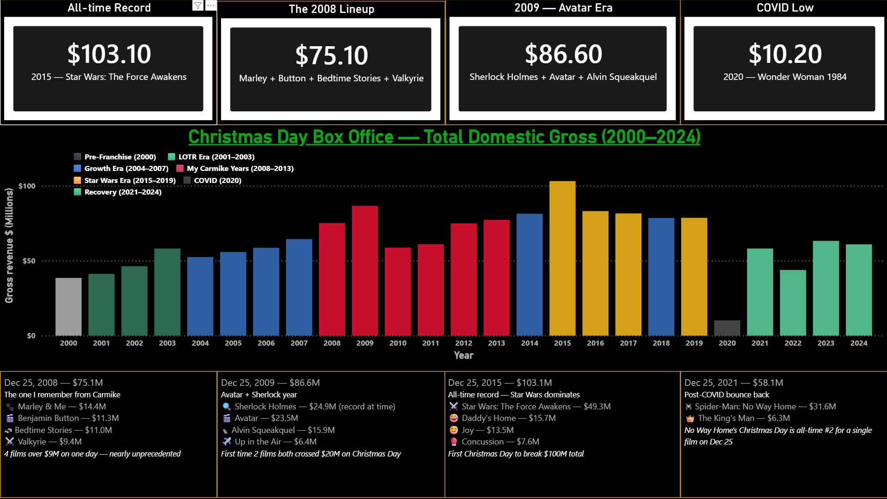

# 🎬 Christmas Day Box Office History (2000–2024)
### Side Project | Tools: Python · SQLite · Power BI · HTML/JavaScript

A data analyst's look at the busiest Christmas Days in cinema history — inspired by a personal memory of working the floor at Carmike Cinemas during one of the most stacked December 25th lineups ever recorded.

**Personal note:** I worked at Carmike Cinemas from August 2008 to December 2013, first in Snellville, GA and then in Athens, GA. Christmas Day 2008 was one of the busiest single days I ever experienced in a movie theater — Marley & Me, The Curious Case of Benjamin Button, Bedtime Stories, and Valkyrie all opened on the same day. I always assumed that was one of the biggest Christmas Days ever. Turns out it was — but it took Star Wars and Avatar to actually beat it.

---

## Tools Used
| Tool | Purpose |
|---|---|
| Python | Database build and CSV export scripts |
| SQLite | Structured data storage — 5 tables |
| Power BI | Interactive dashboard |
| HTML / Chart.js | Standalone web visualization |
| Box Office Mojo | Primary data source |
| Deadline / Variety | Supplementary box office reporting |

---

## The Question

December 25, 2008 had four films all gross over $9M on the same day. Was that actually one of the biggest Christmas Days ever? And what did it take to beat it?

**The answer:** Yes — 2008 ranked among the top 5 Christmas Days on record at the time. What ultimately beat it:
- **2009** — Sherlock Holmes + Avatar ($86.6M total)
- **2015** — Star Wars: The Force Awakens alone pulled $49.3M, pushing the total to $103.1M — the first Christmas Day to ever break $100M

---

## Data & Methodology

Christmas Day box office totals were sourced from Box Office Mojo for all years 2000–2024. Individual film grosses for notable years were sourced from Box Office Mojo and Deadline box office reports. The 2000 total is estimated from individual confirmed film grosses where a single daily total was not available.

All data is flagged with a `data_quality` column — `'confirmed'` for direct Box Office Mojo sourced figures, `'estimated'` for calculated/interpolated values.

---

## Database Structure

Five tables built in SQLite:

| Table | Rows | Description |
|-------|------|-------------|
| `annual_totals` | 25 | Total Christmas Day gross, #1 film, era, day of week (2000–2024) |
| `notable_films` | 22 | Individual film performances on Dec 25 for landmark years |
| `era_summary` | 6 | Aggregated stats by era — Pre-franchise through Recovery |
| `top_film_share` | 25 | What % of the total day did the #1 film capture each year |
| `day_of_week_summary` | 7 | Does the day of week Christmas falls on affect box office? |

---

## SQL Highlights

**Top 5 Christmas Days ever:**
```sql
SELECT year, total_gross_mil, top_film, top_film_gross, era
FROM annual_totals
ORDER BY total_gross_mil DESC
LIMIT 5;
```

**How dominant was the #1 film each year:**
```sql
SELECT year, top_film, top_film_gross,
       total_gross_mil,
       top_film_pct_of_total
FROM top_film_share
ORDER BY top_film_pct_of_total DESC;
```

**Does day of week matter?**
```sql
SELECT day_of_week, avg_gross, max_gross, occurrences
FROM day_of_week_summary
ORDER BY avg_gross DESC;
```

**The Carmike years vs everything else:**
```sql
SELECT
    CASE WHEN bryce_carmike = 1 THEN 'Carmike Years' ELSE 'Other Years' END AS period,
    COUNT(*) as years,
    ROUND(AVG(total_gross_mil), 1) as avg_gross,
    MAX(total_gross_mil) as best_year
FROM annual_totals
GROUP BY period;
```

---

## Dashboard



The Power BI dashboard includes:

**Four stat cards at top:**
- All-time record — $103.1M (2015, Star Wars: The Force Awakens)
- My busiest Christmas — $75.1M (2008, Marley & Me lineup)
- The year after — $86.6M (2009, Sherlock Holmes + Avatar)
- COVID low — $10.2M (2020, Wonder Woman 1984)

**Main bar chart:** Total Christmas Day gross by year, colored by era:
- ⬜ Pre-Franchise (2000)
- 🟩 LOTR Era (2001–2003)
- 🟦 Growth Era (2004–2007)
- 🟥 My Carmike Years (2008–2013)
- 🟨 Star Wars Era (2015–2019)
- ⬛ COVID (2020)
- 🟢 Recovery (2021–2024)

**Four lineup cards at bottom:** Detailed breakdown of the four most notable Christmas Day lineups — 2008, 2009, 2015, and 2021.

---

## Key Findings

- **2008 was genuinely historic.** Four films all clearing $9M on one day (Marley & Me $14.4M, Benjamin Button $11.3M, Bedtime Stories $11.0M, Valkyrie $9.4M) is nearly unprecedented. It ranked 4th all-time at the time.

- **2009 beat it.** Sherlock Holmes set a new single-film Christmas Day record at $24.9M. Combined with Avatar ($23.5M) — already a phenomenon in its 11th day of release — the total hit $86.6M. First time two films both crossed $20M on Christmas Day.

- **Star Wars changed everything.** The Force Awakens in 2015 earned $49.3M on Christmas Day alone — more than the entire Christmas Day total for any year from 2000 to 2007. The $103.1M total remains the all-time record.

- **COVID was catastrophic.** 2020 dropped to $10.2M — an 87% decline from 2019. Wonder Woman 1984's simultaneous HBO Max release accelerated the damage.

- **Friday is the best day for Christmas box office.** When December 25 falls on a Friday, average gross is ~$73M vs ~$55M on Monday — a 33% difference driven by weekend momentum.

- **Recovery is real but incomplete.** Post-COVID years (2021–2024) average $56.5M — strong by pre-Star Wars standards but below the 2015–2019 peak average of $89.3M.

---

## Web Visualization

A standalone HTML version of the chart is included — open `christmas_box_office.html` in any browser. Built with Chart.js, no server required.

[View on GitHub Pages](https://brycegardner90.github.io/christmas-day-box-office) *(enable GitHub Pages to activate)*

---

## Files in This Repository

| File | Description |
|------|-------------|
| `christmas_boxoffice.db` | SQLite database — all 5 tables |
| `build_database.py` | Python script to build and populate the database |
| `export_csvs.py` | Python script to export all 5 CSVs |
| `christmas_box_office.html` | Standalone Chart.js web visualization |
| `csv/` | Five CSV exports for external analysis |
| `screenshots/` | Dashboard screenshot |

---

## About This Project

This is a side project from my data analytics portfolio — a fun personal analysis inspired by a genuine memory from my time in the cinema industry. For my full portfolio including business analysis deep dives into Carmike Cinemas, On The Border, and Kona Grill, visit my GitHub.

---

*Built by Bryce Gardner · [LinkedIn](https://www.linkedin.com/in/bryce-gardner-16a889183) · [GitHub](https://github.com/brycegardner90)*
